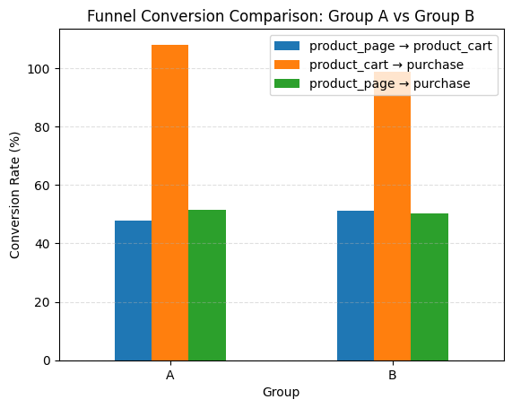
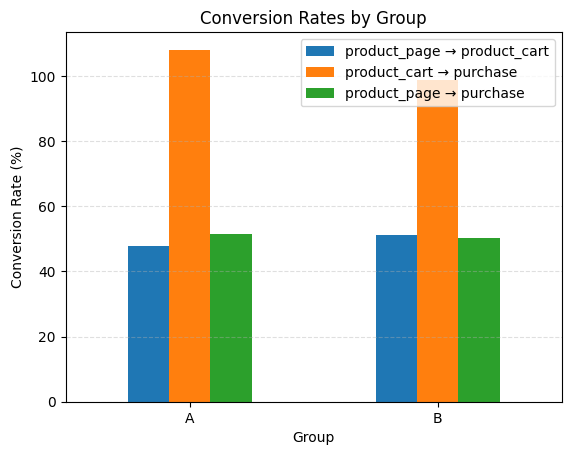
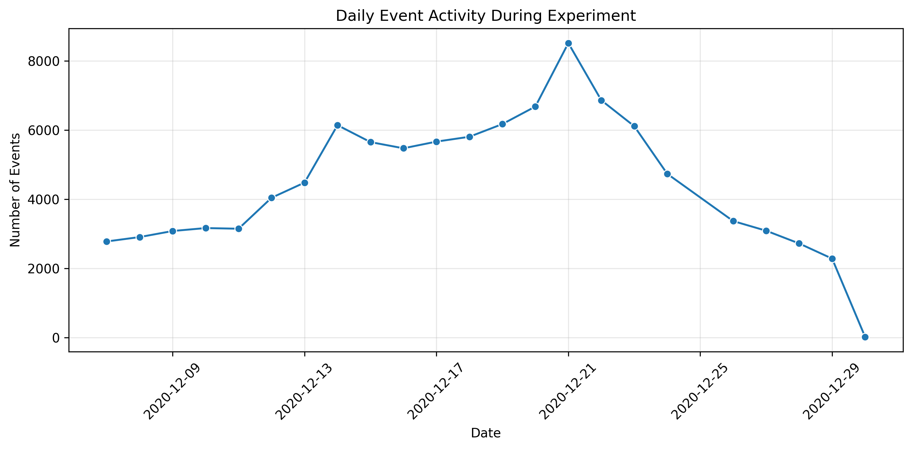
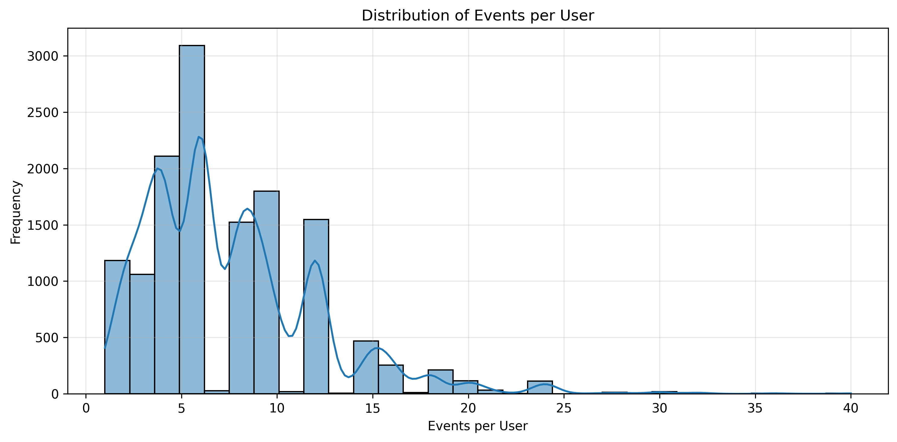

# A/B Test Analysis for E-commerce Funnel Optimization

## Project Overview

This project analyzes the results of an A/B test conducted on an e-commerce platform to evaluate whether a new funnel experience (Group B) improves user conversion compared to the current version (Group A).

The analysis includes data cleaning, exploratory data analysis, funnel evaluation, experiment validation, and statistical hypothesis testing.

---

## Business Objective

Determine if the new product funnel increases user progression and final purchases enough to justify implementation.

---

## Tools & Libraries

- Python  
- Pandas  
- NumPy  
- Matplotlib  
- Seaborn  
- Statsmodels  
- Jupyter Notebook  

---

## Project Workflow

### 1. Data Cleaning & Validation
- Checked duplicates and structure consistency
- Converted date columns
- Validated experiment timeline
- Verified dataset integrity

### 2. Exploratory Data Analysis
- User distribution by A/B group
- Region and device segmentation
- Event activity behavior
- User engagement patterns

### 3. Funnel Analysis
Analyzed the following stages:

**product_page → product_cart → purchase**

Compared funnel progression between Group A and Group B.

### 4. Experiment Quality Checks
- No marketing campaign interference detected
- Stable daily traffic
- No abnormal event spikes
- No invalid event timestamps

### 5. Statistical Testing
Used two-proportion Z-tests to compare conversion rates between groups.

---

## Key Visualizations

### Funnel Conversion Comparison



### Conversion Rates by Group



### Daily Event Activity



### Events per User Distribution



---

## Final Results

- Group B improved one intermediate step (**product_page → product_cart**)
- No statistically significant increase in final purchases
- Overall business impact is not meaningful

## SQL Validation

In addition to the pandas-based analysis, the core funnel and conversion metrics were re-validated using SQL against a relational database (SQLite), to demonstrate the analysis holds when working directly against raw, unmerged source tables rather than a pre-joined DataFrame.

See `SQL_Validation_AB_Test.ipynb` for the full walkthrough. Highlights:

- Loaded all four raw CSV files into a relational schema (`events`, `users`, `participants`, `marketing_events`), connected by `user_id`.
- Ran a data quality check that surfaced 887 users enrolled in both experiments simultaneously — a finding not covered in the original notebook.
- Replicated the funnel (unique users per stage, by group) using `JOIN` + `GROUP BY`.
- Replicated the group conversion rates using a multi-CTE query (`WITH ... AS`), confirming the same results as the pandas analysis (Group A: 31.74%, Group B: 27.59%).
- Cross-checked the test period against the marketing campaign calendar and found it overlapped with the Christmas & New Year Promo — a second potential confound alongside the dual-test enrollment issue.
- Broke down conversion rate by device, confirming the group A/B gap holds consistently across Mac, iPhone, Android, and PC.
- Measured average time-to-purchase by group using SQL date functions, finding the two groups convert at a similar speed once a purchase happens — the effect is on *whether* users convert, not how fast.

**Tools used:** SQLite, SQL (JOIN, GROUP BY, HAVING, CTEs, date functions)

### Recommendation

**Do not implement Group B yet.**  
The new version does not improve final conversion enough to replace the current experience.

---

## Repository Structure

```text
AB_Test_Analysis/
│── AB_Test_Project.ipynb
│── README.md
│── requirement.txt
│── data/
│── images/
│── notebooks/
```

## Skills Demonstrated
Data Cleaning
Exploratory Data Analysis
Funnel Metrics
A/B Testing
Hypothesis Testing
Business Recommendations
Data Visualization


### Author
Jorge Moncisvais
Data Analyst | Reporting, Operations & Business Insights